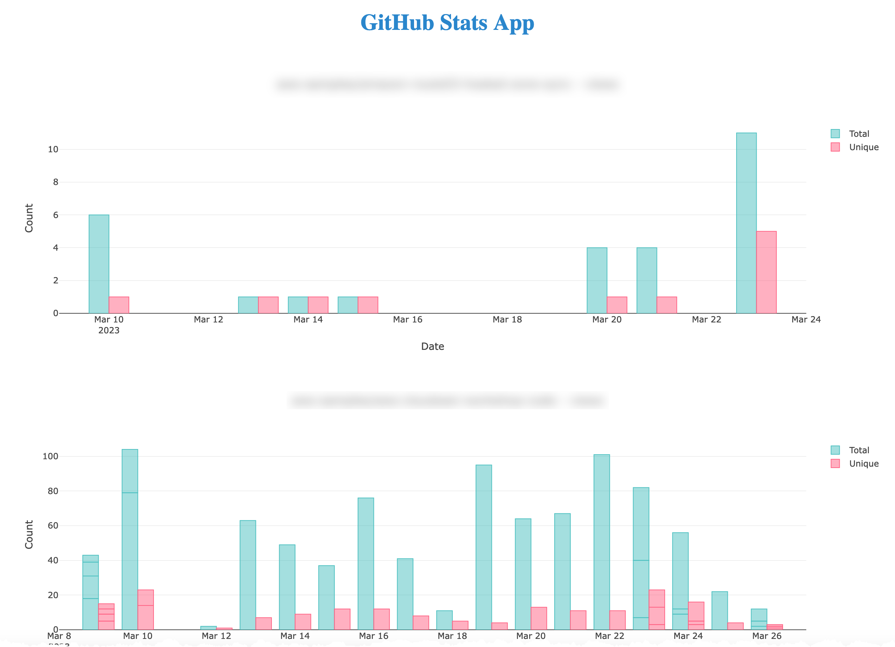

# A Python app to fetch GitHub repository traffic stats

Both the standalone app and AWS Lambda function will:

Fetch a list of all the repos under:

- Org name
- Team name

When fetchng the repo list, if the repo is either privarte or archived it will be excluded.

## Standalone App

The stanalone App saves the repo data locally in the ./traffic_stats directory.

Running the app will start a Flask App and open a web page to the local Flask server:



##### Python requirements:

Create a new Python virtual environment:

```
$ python3 -m venv .venv
```

Now activate the new virtual environment:

```
$ source ./.venv/bin/activate
```

The local requirements.txt file should be all you need:

```
$ pip install -r ./requirements.txt
```

If this doesn't work as expect4d for any reason. you can deactivate the virtual environment with the `deactivate` command.

Then, recreate a new virtual environment, activate it (source ./.venv/bin/activate) and manually install the Python packages with pip as below:

First, install Python as it's a pre-requsite for some of the other packages:

```
$ pip install Cython
```

```
$ pip install pip jnius dash dash_bootstrap_components gunicorn psutil requests pyyaml PyGithub --upgrade
```
The standalone app uses local environment details for:

- access_token = os.environ["GITHUB_TOKEN"]
- org_name = os.environ["GITHUB_ORG_NAME"]
- team_name = os.environ["GITHUB_TEAM_NAME"]

As such, these three environment variables will need to be available. 

To create them:

```
export <environment variable> = <value>
i.e.: export GITHUB_ORG_NAME = "my-org-name"
```

The app takes the following command line arguments:

- [ --run| -r ]  Runs the Flask App and opens a local browser
- [ --create | -c ] Creates a yaml file from the list of repos
- [ --update | -u ] Updates the repo list and stats
- [ --shutdown | -s" ] Shuts down the Flask App
- [ --list | -l ] List Repos

As the app runs in the background, to stop the app use the --shutdown (-s) flag.

## AWS Lambda Function

The AWS Lambda function gathers the same stats via the same mechanism, however the CDK app also creates a DyamoDB table and stores data in the DyamoDB table. The DyamoDB table will be updaetd everytime the Lambda function runs.

The Lambda function is run on a period basis triggered by an Eventbridge schedule.

After cloning this project, first:

- Activate the Python virtual environment

```
$ source ./venv/bin/activate
```

- Install the required dependencies:

```
$ pip install -r requirements.txt
```

To add Python packages to the Lambda function layer (a layer is required to add additional Pyhon packages that aren't natively available):

```
$ pip3 install pip Cython PyGithub requests boto3 --upgrade --target ./lambda/layer
```

At this point you can now synthesize the CloudFormation template for this code.

```
$ cdk synth
```

Other useful CDK commands:

To add additional dependencies, for example other CDK libraries, just add
them to your `setup.py` file and rerun the `pip install -r requirements.txt`
command.

## Useful commands

 * `cdk ls          list all stacks in the app`
 * `cdk synth       emits the synthesized CloudFormation template`
 * `cdk deploy      deploy this stack to your default AWS account/region`
 * `cdk diff        compare deployed stack with current state`
 * `cdk docs        open CDK documentation`

To dploy the stack, run the following command:

```
$ cdk deploy
```


## Cleanup

To clean up the stack, run the following command:

```
$ cdk destroy
```


## Testing the Lambda function using the AWS CLI

In this example: 
- We know the Lambda function name is "GitHubRepoStatsFunction" 
- The region is "eu-west-1"

To run the Lambda function (synchronously), use the following command:

```
aws lambda invoke --function-name GithubStatsFunction \
    --region eu-west-1 \
    --cli-binary-format raw-in-base64-out \
    --payload '{"key": "test"}' /dev/stdout
```

This should print out to standard output:

```
{
	"statusCode": 200, "body": "\"Stats updated successfully.\""
}

{
	"StatusCode": 200,"ExecutedVersion": "$LATEST"
}
```

If you want to test the Lambda function asynchronously, use the following command:

```
 aws lambda invoke --function-name GithubStatsFunction \
   --region eu-west-1 \
   --invocation-type Event \
   --cli-binary-format raw-in-base64-out \
   --payload '{"key": "test"}' /dev/stdout
```

A successful response will look like this:

```
{
    "StatusCode": 202
}
```
